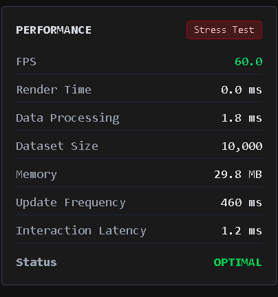

# Performance-Critical Data Visualization Dashboard

## Overview
A high-performance, real-time data visualization dashboard designed to elegantly handle high-frequency data streams (up to 10,000 points updated rapidly). It features interactive charts, a virtualized data table, and robust performance monitoring, ensuring a smooth 60 FPS experience even under stress conditions.

## Features
- **Real-Time Data Streaming:** Simulates high-frequency data ingestion and gracefully manages thousands of points.
- **Interactive Canvas Charts:** Includes a Line Chart and Bar Chart rendered entirely on native HTML5 Canvas for peak rendering performance. Features mouse pan and zoom interactions without triggering costly React render cycles.
- **Virtualized Data Table:** Displays 10,000+ rows instantly using a custom virtual-scrolling implementation. Supports asynchronous sorting.
- **Advanced Filtering:** Context-driven filters allow time range extraction, category filtering, and metric aggregations (1m, 5m, 1h).
- **Web Worker Offloading:** Heavy mathematical aggregation and sorting algorithms are offloaded to background threads.
- **Responsive UX:** Fully responsive CSS grid and flex layouts built with Tailwind, gracefully degrading to single columns on mobile devices with horizontal scrolling for dense data tables.
- **Accessibility (a11y):** Keyboard navigable table headers and distinct focus rings.

## Architecture
This dashboard strictly adheres to a separation of concerns:
- **UI Layer (React):** Standard declarative React handles form controls, buttons, layout, and HTML structuring.
- **Rendering Engine (Canvas API):** Bypasses React DOM reconciliation to manually paint pixels for data-heavy charts using `requestAnimationFrame`.
- **Data Pipeline (Web Workers + Hooks):** React hooks fetch data concurrently and pass `O(N)` calculations to isolated CPU cores.

## Technology Stack
- **Framework:** Next.js 14+ (App Router), React 18
- **Language:** TypeScript
- **Styling:** Tailwind CSS v4
- **State Management:** React Context (No Redux/MobX)
- **Testing:** Jest, React Testing Library, JSDOM

## Rendering Strategy
The dashboard utilizes a **Hybrid Rendering Approach**:
- SVGs and native DOM elements are utilized for axis labels, grid lines, and interactive controls because they scale cleanly and are easy to manipulate with CSS.
- The actual data geometry (lines, bars) is drawn on a `<canvas>` element. `useChartRenderer` handles setting up High-Resolution scaling (checking `window.devicePixelRatio`) to prevent canvas blurring on Retina displays.

## Data Pipeline
1. `useDataStream` continually polls the mock generator for data blocks.
2. `useFilters` provides global constraints.
3. `useDataWorker` takes the raw stream and filter rules, serializing them to `dataWorker.ts`.
4. The background thread processes aggregations (`1m`, `5m`) and table sorting (`O(N log N)`) and returns the results.
5. `ChartContainer` and `DataTable` listen for the async payload and map it to visual space.

## Performance Optimizations
1. **React.memo & useDeferredValue:** Limits expensive table redraws and prevents non-urgent React DOM thrashing when the data changes rapidly.
2. **Absolute DOM Virtualization:** Table renders only 15-20 HTML nodes at a time instead of 10,000, reducing browser memory footprint by 99%.
3. **Web Worker Offloading:** Keeps the main browser thread clear for Canvas animations to reach 60 FPS.
4. **requestAnimationFrame Throttling:** Pan and zoom events are painted asynchronously to match monitor refresh rates rather than triggering React state updates.

## Running Locally

To run the dashboard in development mode with HMR (Hot Module Replacement):
```bash
npm install
npm run dev
```
Open [http://localhost:3000](http://localhost:3000) to view the application.

## Production Build

To test the application exactly as it would behave in a cloud environment:
```bash
npm run build
npm start
```

## Performance Testing
You can measure the application's stability by toggling **Stress Test Mode** within the Debug Panel.
- It changes the data interval to 5ms (blasting hundreds of points a second).
- The built-in **Performance Monitor** tracks FPS, interaction latency, and processing time via browser `PerformanceObserver` APIs.

To run the automated test suite verifying mathematical correctness:
```bash
npm run test
```

## Browser Compatibility
Tested on the latest versions of:
- Google Chrome
- Mozilla Firefox
- Apple Safari
- Microsoft Edge

## Screenshots

These screenshots demonstrate the dashboard's responsive design, real-time visualization, performance monitoring, and stress-testing functionality.

### Main Dashboard


### Debug Panel


### Performance Monitor


### Data Stream Table


## Deployment
This Next.js application is ready to be deployed to Vercel, AWS Amplify, or any Node.js hosting platform with zero configuration required.
(https://performance-data-dashboard-omega.vercel.app/dashboard)

## Project Structure
```text
/app               - Next.js page routing
/components
  /charts          - Canvas hybrid components
  /controls        - Forms, buttons, debuggers
  /providers       - React Context state
  /ui              - DataTable and generic UI
/hooks             - Custom virtualization and worker hooks
/lib               - Math, canvas utilities, worker scripts
/__tests__         - Jest mathematical suites
```

## Design Decisions
- **Custom Charting vs Libraries:** Building charts from scratch with native Canvas was explicitly chosen over Chart.js or D3 to guarantee total control over the `requestAnimationFrame` loop, enabling sub-millisecond draw times.
- **Context vs Redux:** Using native React Context split into granular providers prevents the "prop drilling" problem without the heavy bundle size and boilerplate of Redux.

## Known Limitations
- The current Canvas logic draws straight lines; spline interpolation/smoothing was omitted for maximum frame rate efficiency.
- Web Worker structured cloning introduces a 1-2ms penalty which makes the worker slower than the main thread on very small datasets (< 1000 items), though it scales significantly better above 5,000 points.
